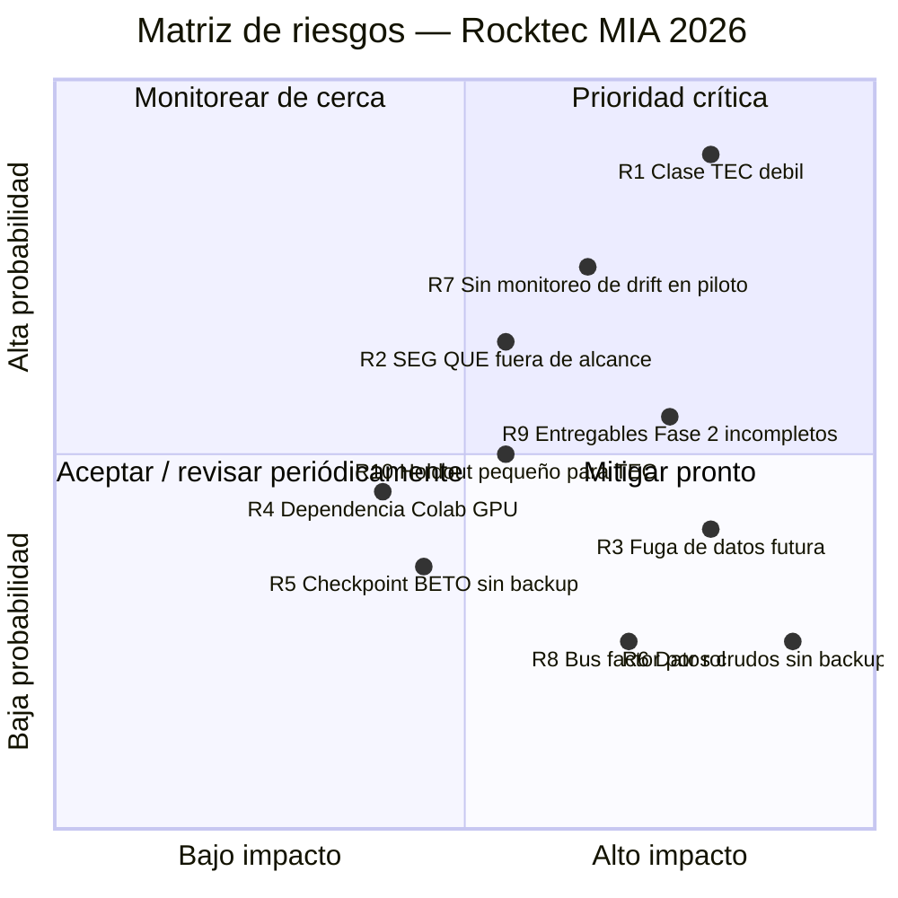

# Análisis de Riesgos — Fase 2
## Plataforma de Clasificación de Intenciones — Rocktec MIA 2026

**Versión:** 1.0
**Fecha:** Julio 2026
**Responsable:** Luis Chica (A3) — Arquitectura
**Entregable de:** README.md §"Próxima Fase (FASE 2)", ítem 5

---

## 1. Metodología

Cada riesgo se evalúa en dos ejes:

- **Probabilidad** — qué tan probable es que ocurra (o, para los ya materializados, que se repita/agrave).
- **Impacto** — qué tan grave sería su efecto sobre el proyecto (académico) o la operación de Rocktec (si el modelo llega a piloto).

**Severidad = Probabilidad × Impacto**, en 4 niveles: 🟢 Baja · 🟡 Media · 🟠 Alta · 🔴 Crítica.

Los riesgos se agrupan en 5 categorías: **Datos y Anotación**, **Modelo/ML**, **Infraestructura y
Reproducibilidad**, **Negocio y Operación**, **Proyecto y Equipo**. Varios ya están *materializados*
(no son hipótesis — ya ocurrieron o son un hecho conocido del dataset actual); para esos, la
"mitigación" es de contención y monitoreo, no de prevención.

---

## 2. Matriz de Riesgos (Probabilidad × Impacto)

*(Eje X: impacto de 0 a 1. Eje Y: probabilidad de 0 a 1. Cuadrante superior derecho = crítico.)*

---

## 3. Tabla Detallada de Riesgos

### 3.1 Datos y Anotación

| ID | Riesgo | Probabilidad | Impacto | Severidad | Mitigación | Responsable |
|----|--------|:---:|:---:|:---:|------------|-------------|
| **R1** | Clase **TEC** con desempeño insuficiente en ambos modelos (F1 ≤ 0.47; solo 51 ejemplos totales, 8 en holdout) — **ya materializado**. Consultas técnicas reales corren riesgo de enrutarse mal. | Alta | Alto | 🔴 Crítica | Ronda de anotación adicional dirigida a TEC antes de Fase 5, en vez de seguir iterando arquitectura (ver `DISEÑO_MLOPS_FASE2.md` §8, "Pendiente"). Mientras no se amplíe el dato: aplicar un umbral de confianza bajo para TEC y enrutar esos casos a revisión manual en vez de automatizar la respuesta. | Patricia (anotación) + Luis Cruel (reentrenamiento) |
| **R2** | **SEG** y **QUE** quedaron fuera del alcance del modelo (5 y 4 filas de 1,297 — decisión de alcance, no bug). En producción real, mensajes de seguimiento o quejas se forzarán a una de las 5 clases modeladas. | Media-Alta | Medio | 🟠 Alta | Loggear predicciones de baja confianza / mensajes con palabras clave de queja-seguimiento para curar una ronda de anotación futura de estas 2 clases; documentar la limitación explícitamente ante Rocktec antes del piloto. | Luis Chica (diseño) + Patricia (anotación futura) |
| **R10** | El F1-macro final (0.79–0.80) se midió **una sola vez** sobre un holdout de 197 filas (TEC solo 8 filas) — el intervalo de confianza real es amplio; el número podría no sostenerse en tráfico nuevo. | Media | Medio | 🟡 Media | Durante el piloto (Fase 5), muestrear y etiquetar continuamente una fracción de predicciones reales para verificar que el F1 se mantiene, en vez de asumir que 0.79 es estable indefinidamente. | Luis Cruel |

### 3.2 Modelo / ML

| ID | Riesgo | Probabilidad | Impacto | Severidad | Mitigación | Responsable |
|----|--------|:---:|:---:|:---:|------------|-------------|
| **R3** | Recurrencia de **fuga de datos hacia el holdout** en futuros experimentos — ya ocurrió una vez (comparación exploratoria BETO vs. TF-IDF, corregida en Sprint 7). El riesgo de que alguien vuelva a entrenar sobre el dataset completo por descuido sigue vigente. | Alta (sin disciplina) | Alto | 🟠 Alta | Regla dura ya establecida: ningún experimento nuevo debe leer `holdout_test.csv`, salvo `13_evaluacion_holdout.py`, y solo una vez por modelo. Cualquier notebook/script nuevo de entrenamiento debe partir explícitamente de `train_val.csv`. | Luis Cruel |
| **R4** | Reentrenar **BETO fine-tuned** depende de GPU gratuita de Google Colab (no hay GPU local en el entorno de desarrollo) — la cuota/disponibilidad gratuita de Colab puede cambiar sin aviso. | Media | Medio | 🟡 Media | Mitigado por diseño: TF-IDF+LR (sin dependencia de GPU) es el modelo elegido para producción precisamente por esto (`DISEÑO_MLOPS_FASE2.md` §8). BETO queda documentado como upgrade candidato, no como dependencia crítica del camino de producción. | Luis Cruel |

### 3.3 Infraestructura y Reproducibilidad

| ID | Riesgo | Probabilidad | Impacto | Severidad | Mitigación | Responsable |
|----|--------|:---:|:---:|:---:|------------|-------------|
| **R5** | El checkpoint de BETO fine-tuned (~420MB, `06_resultados/modelos/beto_finetuned_best/`) no está versionado en git (excede el límite de 100MB de GitHub) y no hay un backup externo documentado. | Media | Medio | 🟡 Media | Confirmar un respaldo fuera del working directory (Drive u otro almacenamiento) **o** aceptar como plan B el reentrenamiento bajo demanda vía `12_beto_finetuning_colab.ipynb` (~2 min en T4, resultado reproducible con `random_state` fijo). | Luis Chica |
| **R6** | Los 4 archivos Excel crudos originales (`01_datos_crudos/`, ~15K registros) están gitignored por tamaño y no hay un repositorio de respaldo externo documentado en el proyecto. Si se pierden localmente, **todo el pipeline es irreproducible desde cero** (no solo el modelo — la base de anotación completa). | Baja-Media | Crítico | 🟠 Alta | Confirmar y documentar dónde vive el respaldo real de estas 4 fuentes (Drive corporativo de Rocktec, copia de Patricia, etc.) fuera de este directorio de trabajo. | Patricia |
| **R7** | La Etapa 5 del diseño MLOps (monitoreo de drift vía PSI) está definida solo como **alcance offline/académico** (`DISEÑO_MLOPS_FASE2.md` §3). Si el modelo pasa a un piloto con tráfico real de Rocktec sin este monitoreo activo, no hay forma de detectar degradación (p. ej. nuevos productos o campañas que cambian el vocabulario de los mensajes). | Alta (si el piloto arranca sin refuerzo) | Medio | 🟠 Alta | Implementar el cálculo de PSI ya diseñado como job periódico (no solo teórico) antes de que arranque el piloto de Fase 5, comparando la distribución de predicciones nuevas contra la del set de entrenamiento. | Luis Chica |

### 3.4 Negocio y Operación

*(Riesgos que aplican si/cuando el modelo se usa con tráfico real de Rocktec, más allá del alcance académico.)*

| ID | Riesgo | Probabilidad | Impacto | Severidad | Mitigación | Responsable |
|----|--------|:---:|:---:|:---:|------------|-------------|
| — | Falsos negativos en **COT** o **VEN** (cotizaciones y ventas — las clases de mayor impacto de negocio directo) generados por TF-IDF+LR en vez de BETO fine-tuned, que es mejor en esas dos clases específicas (F1 0.86→0.98 en COT, 0.77→0.91 en VEN). | Media | Alto | 🟠 Alta | Ya anticipado en la decisión de modelo (`DISEÑO_MLOPS_FASE2.md` §8): si el monitoreo del piloto muestra errores costosos ahí, reevaluar el swap dirigido a BETO fine-tuned para esas dos clases, sin reemplazar todo el sistema. | Luis Cruel |

### 3.5 Proyecto y Equipo

| ID | Riesgo | Probabilidad | Impacto | Severidad | Mitigación | Responsable |
|----|--------|:---:|:---:|:---:|------------|-------------|
| **R8** | Roles muy especializados y sin redundancia (Patricia = datos, Luis Cruel = modelos, Luis Chica = arquitectura). Si alguno se bloquea, esa área queda sin cobertura inmediata. | Baja | Alto | 🟡 Media | La disciplina de documentación ya practicada (`CHANGELOG.md`, `README.md` actualizados en cada sprint) reduce el costo de que otro miembro retome un área — mantenerla es la mitigación, no un proceso nuevo. | Equipo completo |
| **R9** | De los 5 entregables de Fase 2, solo 2 están completos hoy (Diagrama UML, Pipeline detallado). **Propuesta revisada** y **Cronograma semanal con responsables** siguen pendientes, con Fase 3 venciendo el 31 Ago (~5 semanas). | Media | Alto | 🟠 Alta | Cerrar el cronograma semanal como siguiente entregable inmediato y usarlo para trackear el resto de Fase 2 y el arranque de Fase 3, en vez de dejarlo implícito. | Luis Chica |

---

## 4. Riesgos Ya Materializados vs. Potenciales

Para dejar explícito qué es un hecho conocido del proyecto hoy (25 Jul 2026) y qué es una
posibilidad futura a vigilar:

**Ya materializados (contención, no prevención):**
- R1 — TEC con F1 ≤ 0.47 en ambos modelos.
- R2 — SEG/QUE excluidos del modelo por falta de datos.
- R3 — Ya ocurrió una fuga de datos una vez (corregida en Sprint 7).
- R9 — 3 de 5 entregables de Fase 2 aún pendientes.

**Potenciales (a vigilar, no han ocurrido):**
- R4, R5, R6, R7, R8, R10, y el riesgo de negocio de la §3.4.

---

## 5. Próxima Revisión

Este documento debe revisarse al cierre de cada fase (próxima revisión: cierre de Fase 3, 31 Ago
2026) para reclasificar severidades y marcar mitigaciones completadas.

---

*Documento generado: Julio 2026 — Equipo MIA Rocktec*
