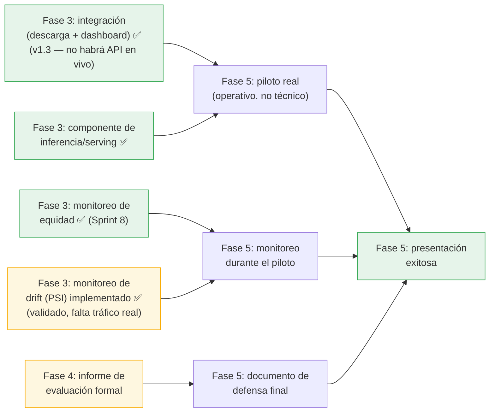

# Diagnóstico de Estado — Fases 3, 4 y 5
## Plataforma de Clasificación de Intenciones — Rocktec MIA 2026

**Versión:** 1.4
**Fecha:** Agosto 2026 (actualizado; v1.0 era de Julio 2026, v1.1/v1.2/v1.3 del 04 Ago 2026)
**Responsable:** Luis Chica (A3) — Arquitectura
**Referencia:** `README.md` §"Fases del Proyecto"

---

## 1. Metodología

`README.md` solo define una meta/hito por fase (p. ej. Fase 3 → "Pipeline funcional", Fase 4 →
"F1 ≥ 0.75", Fase 5 → "Presentación exitosa"), sin un desglose de entregables — igual que ocurría
con Fase 2 antes de este trabajo. Este diagnóstico infiere el alcance esperado de cada fase a partir
de (a) las 5 etapas ya diseñadas en `05_documentacion/DISEÑO_MLOPS_FASE2.md`, (b) lo que el nombre
de cada fase implica típicamente en un proyecto de este tipo, y (c) evidencia real en el repositorio
(scripts, resultados, documentos), marcando cada punto como ✅ hecho / 🟡 parcial / ❌ pendiente.

**Cambios en v1.1:** se incorpora el trabajo de Sprint 8 (umbral de confianza adaptativo, active
learning para TEC, anonimización v2.0, monitoreo de equidad) y Sprint 9 (dashboard Streamlit con
upload directo de chat de WhatsApp) — ver `CHANGELOG.md` para el detalle completo de cada uno. Se
corrige también el ítem de explicabilidad BETO, que v1.0 marcaba como "sin commitear" y ya está
commiteado desde el 25 Jul 2026 (`d7b7fa9`).

**Cambios en v1.2 (04 Ago 2026):** se implementa `21_monitoreo_drift.py`, cerrando el que este mismo
documento identificaba como el bloqueante más crítico restante (Etapa 5 — monitoreo de drift, PSI).
Ver detalle en la sección Fase 3 más abajo y en `CHANGELOG.md`.

**Cambios en v1.3 (04 Ago 2026):** corrección importante de alcance — Rocktec **no tiene acceso a la
WhatsApp Business API** (ni lo tendrá en el horizonte de este proyecto). El mecanismo de integración
**definitivo**, no un sustituto temporal, es la descarga manual de conversaciones desde WhatsApp y su
carga al dashboard (`19_dashboard_streamlit.py`, Tab 4). Esto invalidaba la lectura de v1.1/v1.2 de
que el "piloto real" de Fase 5 estaba bloqueado por falta de integración en vivo — no lo está: el
piloto puede arrancar con el mecanismo que ya existe. Se corrigen las filas de Fase 3
("Integración con WhatsApp Business") y Fase 5 ("Piloto real") más abajo.

**Cambios en v1.4 (04 Ago 2026):** se implementa `22_pipeline_orquestado.py`, cerrando la última
brecha técnica de Fase 3 — un entrypoint único que corre feature engineering → evaluación honesta en
holdout → reentrenamiento de producción → monitoreo (equidad + drift), con ETL y los experimentos de
comparación de arquitecturas (grid search, validación estadística) como etapas opcionales explícitas.
Validado con una corrida real end-to-end (`06_resultados/pipeline/reporte_pipeline.txt`), incluyendo
una corrida con `--incluir-etl`. De paso corrige un bug preexistente en `04_feature_engineering.py`
(el demo de 7 frases fallaba con `min_df=2` por falta de vocabulario repetido — no afectaba al uso
real del vectorizador con datasets de cientos/miles de filas).

---

## 2. Fase 3 — Desarrollo e Implementación

**Meta formal (README):** "Pipeline funcional" — vence **31 Ago 2026**.

| Ítem | Estado | Evidencia / brecha |
|------|:---:|---------------------|
| Etapa 1 (Ingesta & ETL) implementada como scripts ejecutables | ✅ | `01_limpieza_datos.py`, `02_consolidar_datos.py`, `03_validar_duplicados.py`, `06_pipeline_completo.py` |
| Etapa 2 (Feature Engineering: TF-IDF + tokenización BERT) implementada | ✅ | `04_feature_engineering.py` |
| Etapa 3 (Entrenamiento con tracking MLflow) implementada | ✅ | `05_entrenar_modelos.py`, `12_beto_finetuning.py`, `mlruns/` |
| Etapa 4 (Evaluación) implementada y reportada | ✅ | Ver Fase 4 más abajo — meta cuantitativa ya alcanzada |
| Etapa 5 — **monitoreo de equidad** por perfil de cliente | ✅ (Sprint 8, 31 Jul) | `20_monitoreo_equidad.py` (Evidently AI) detecta brecha significativa (F1-macro 0.7418 vs. 0.5189 entre perfiles) — ver `06_resultados/equidad/`. Es una dimensión de monitoreo distinta al drift (mide sesgo por segmento, no cambio de distribución en el tiempo). |
| Etapa 5 — **monitoreo de drift (PSI)** implementado como job real | ✅ (04 Ago 2026) | `21_monitoreo_drift.py`: calcula PSI de la distribución de intenciones (`log_predicciones.csv` vs. `train_val.csv`) y PSI de confianza (usando confianza *out-of-fold*, no in-sample, para no sobreestimar drift). Corrida de validación (log sembrado con 345 mensajes históricos nunca anotados, no tráfico real de piloto): PSI intenciones = 0.11 (moderado), PSI confianza = 0.75 (severo, pero explicado por contenido fuera de dominio en el lote simulado — ver `06_resultados/drift/reporte_drift.txt`). **Sigue pendiente:** correr esto sobre tráfico real de un piloto (Fase 5) para una lectura de drift válida; drift de vocabulario (features nuevas) queda fuera de alcance. |
| Pipeline orquestado end-to-end en un solo punto de entrada (ETL → features → entrenamiento → evaluación → monitoreo) | ✅ (04 Ago 2026) | `22_pipeline_orquestado.py`: encadena `04_feature_engineering.py` → `13_evaluacion_holdout.py` → `15_entrenar_produccion.py` → `20_monitoreo_equidad.py` → `21_monitoreo_drift.py`, con `06_pipeline_completo.py` (ETL) y los experimentos (`05_entrenar_modelos.py`, `07_validacion_estadistica.py`) como etapas opcionales por flag. Validado con corrida real (`06_resultados/pipeline/reporte_pipeline.txt`) en ~109s (~58s con `--incluir-etl`, que además es determinista: no generó cambios en `03_datos_procesados/` tras la primera normalización). Deliberadamente NO re-ejecuta `09_crear_holdout_set.py` — repartir el holdout en cada corrida sería el mismo riesgo de fuga de datos que motivó el fix de Sprint 7. |
| Componente de inferencia / serving (tomar 1 mensaje nuevo y devolver una predicción) | ✅ (batch) | `15_entrenar_produccion.py` + `16_inferencia.py` (`predecir(textos)` y CLI). Diseño deliberado por lotes, no API en vivo. |
| **Umbral de confianza adaptativo** para decidir automatización vs. revisión humana | ✅ (Sprint 8, 30 Jul) | `17_umbral_confianza_adaptativo.py`: umbral óptimo = 0.75, automatiza 70.6% de holdout con F1-auto = 0.9214. Refina la mitigación de R1/R2 ya presente en `16_inferencia.py`. |
| **Interfaz operativa para asesores de Rocktec** | ✅ (Sprint 9, 3 Ago) | `19_dashboard_streamlit.py`: dashboard con clasificador interactivo, métricas, carga masiva por CSV y **Tab 4 — upload directo de chat exportado de WhatsApp** con clasificación automática por cliente. Es la primera pieza pensada para uso directo del equipo comercial, no solo del equipo de datos. **Esta es la integración con WhatsApp** (ver fila siguiente, corregida en v1.3) — no un sustituto provisional de una API que llegaría después. |
| Integración con WhatsApp (el problema de negocio original, `DISEÑO_MLOPS_FASE2.md` §1) | ✅ (alcance corregido, v1.3) | **Rocktec no tiene ni tendrá WhatsApp Business API en el horizonte de este proyecto** — confirmado por el equipo. La integración real y definitiva es descarga manual del chat exportado (`.txt`) + upload al dashboard, Tab 4. No es una limitación a resolver; es el diseño correcto para el contexto de una PYME sin infraestructura de API de mensajería. Cierra este ítem. |
| Base de datos (PostgreSQL) para log de mensajes/predicciones | ❌ (pospuesto, alcance ajustado) | `16_inferencia.py` ya escribe un log a `06_resultados/predicciones/log_predicciones.csv` como sustituto interino. Con integración por descarga manual (no API en vivo), el volumen y la cadencia de datos son bajos — CSV puede ser suficiente de forma permanente, no solo "mientras no hay ingesta en vivo". Reevaluar solo si el volumen de piloto lo justifica. |
| CI/CD | 🟡 | **CI implementado** (`.github/workflows/ci.yml`): compila los scripts y reentrena+evalúa TF-IDF+LR sobre `holdout_test.csv` en cada push a `main`, con gate de F1-macro ≥ 0.75. **CD sigue pendiente**, pero el objetivo ya no es "desplegar una API que reciba mensajes de WhatsApp" — es desplegar el **dashboard Streamlit** como servicio accesible para los asesores (hoy solo se corre localmente), lo cual es mucho más alcanzable sin infraestructura de mensajería. |
| Empaquetado versionado del modelo de producción (TF-IDF+LR) | ✅ | `15_entrenar_produccion.py`: `06_resultados/modelos/produccion/metadata.json` registra versión (`v1.0`), fecha, hiperparámetro ganador y F1 honesto. |
| Anonimización de datos sensibles (PII) | ✅ (Sprint 8, 30 Jul) | `00_anonimizar_dataset.py`: 223/1,500 registros (14.9%) enmascarados → `dataset_consenso_final_anonimizado.csv`. No estaba en el alcance original de Fase 3 pero cierra un gap de manejo de datos que cualquier "pipeline funcional" debería cubrir. |

**Conclusión Fase 3:** las 5 etapas del diseño MLOps existen ahora como scripts ejecutables — con la
implementación de `21_monitoreo_drift.py` el 04 Ago 2026, **las dos dimensiones de monitoreo
(equidad y drift) ya están cubiertas**, aunque el drift todavía no se ha medido sobre tráfico real
(solo sobre un lote simulado de validación). Con la corrección de alcance de v1.3 (integración =
descarga manual + dashboard, no API en vivo), **la integración con WhatsApp deja de ser una brecha**.
Con `22_pipeline_orquestado.py` (v1.4), **la orquestación end-to-end también queda resuelta**. La
única brecha técnica real que queda en Fase 3 es **desplegar el dashboard** como servicio accesible
en vez de correrlo solo en local.

---

## 3. Fase 4 — Evaluación del Modelo

**Meta formal (README):** "F1-macro ≥ 0.75" — vence **14 Sep 2026**.
Estado declarado: "🔜 Por hacer (meta ya validada en holdout, falta cerrar el resto de entregables)".

| Ítem | Estado | Evidencia / brecha |
|------|:---:|---------------------|
| Meta cuantitativa (F1-macro ≥ 0.75 en holdout nunca antes visto) | ✅ | TF-IDF+LR F1=0.7938, BETO fine-tuned F1=0.7967 (`13_evaluacion_holdout.py` → `06_resultados/reporte_holdout_final.txt`) |
| Metodología de evaluación sin fuga de datos | ✅ | Corregida en Sprint 7 (split `train_val.csv` / `holdout_test.csv`, verificación vía `FUENTE_ENTRENAMIENTO.txt`) |
| Matrices de confusión y reportes por clase | ✅ | `confusion_matrix_logistic_regression.png`, `confusion_matrix_svm.png`, `reporte_lr.txt`, `reporte_svm.txt` — **verificar** que correspondan a la corrida final de holdout y no solo al split 80/20 original de `05_entrenar_modelos.py` |
| Explicabilidad (SHAP/LIME) sobre el modelo de producción | ✅ (LR y BETO) | LR: `10_shap_lime_explicabilidad.py`. BETO: `14_explicabilidad_beto.py` — **corregido en v1.1**: ya está commiteado (`d7b7fa9`, 25 Jul 2026), v1.0 de este diagnóstico lo marcaba erróneamente como pendiente. |
| **Umbral de confianza adaptativo** como parte de la estrategia de evaluación operativa | ✅ (Sprint 8) | `17_umbral_confianza_adaptativo.py` — F1-auto = 0.9214 al umbral óptimo (0.75); da una lectura de calidad más realista que el F1-macro plano, al separar automatizable de revisión humana. |
| **Monitoreo de equidad por perfil de cliente** | ✅ (Sprint 8) | `20_monitoreo_equidad.py` — brecha de F1-macro de 0.22 entre `Prospecto_General` y `Comprador_Activo`; relevante como parte de "evaluación" más allá del F1 agregado. |
| Estrategia para mejorar la clase más débil (TEC) | 🟡 (Sprint 8, en curso) | `18_active_learning_tec.py` identificó 30 candidatos de alta incertidumbre para anotación dirigida por los asesores de Rocktec (ver `05_documentacion/S8_Plan_Ampliacion_Dataset_TEC.docx`). **Pendiente:** que los asesores confirmen las 30-40 anotaciones y se reentrene el modelo — impacto estimado F1 TEC 0.47→~0.65+. |
| Análisis de errores cualitativo (qué tipo de mensajes se confunden y por qué, más allá del número) | ❌ | Sigue sin existir un documento dedicado a esto. El active learning de TEC es un insumo relacionado (identifica *dónde* duda el modelo) pero no un análisis de *por qué* se confunde (p. ej. ¿con INF? ¿con COT? ¿mensajes muy cortos?) — sigue siendo una brecha distinta. |
| Informe formal de evaluación de Fase 4 | 🟡 | `INFORME_AJUSTES_Y_VALIDACION.docx` existe pero es el entregable de **Fase 1C** (heurístico vs. consenso) — no cubre la evaluación holdout final, la comparación de arquitecturas de Sprint 7, ni el trabajo de Sprint 8/9. Se necesita un informe nuevo (o una versión ampliada) que consolide todo esto como cierre de Fase 4. |
| Validación de negocio (que alguien de Rocktec revise/valide los resultados) | ❌ | No hay evidencia en el repo de que Rocktec haya revisado el F1 alcanzado o ejemplos reales de predicciones — aunque el dashboard de Sprint 9 y el plan de anotación TEC dirigido a asesores son un primer paso hacia involucrarlos. |
| Clase TEC con soporte insuficiente para evaluar con confianza (8 filas en el holdout) | 🟡 | Riesgo conocido (**R1**, **R10** en `ANALISIS_RIESGOS_FASE2.md`); el active learning de Sprint 8 es la mitigación en curso, pendiente de anotación real. |

**Conclusión Fase 4:** la meta cuantitativa central sigue **cumplida y defendible**. Sprint 8 sumó
dos piezas de evaluación operativa (umbral adaptativo, equidad) que enriquecen el diagnóstico más
allá del F1 agregado, y abrió el camino concreto para mejorar TEC (active learning). La brecha real
sigue siendo de **empaquetado del entregable**: falta el informe formal consolidado y el análisis de
errores cualitativo.

---

## 4. Fase 5 — Piloto y Defensa Final

**Meta formal (README):** "Presentación exitosa" — vence **21 Sep 2026**.

| Ítem | Estado | Evidencia / brecha |
|------|:---:|---------------------|
| Piloto real con tráfico de Rocktec | 🟡 (desbloqueado en v1.3) | **Ya no depende de una integración en vivo que nunca va a existir** — Rocktec no tiene WhatsApp Business API, así que el mecanismo definitivo es descarga manual + dashboard Tab 4. El piloto puede arrancar hoy: falta que asesores de Rocktec empiecen a subir chats reales exportados al dashboard de forma sostenida, no una pieza técnica nueva. |
| Monitoreo de drift (PSI) corriendo sobre el piloto | 🟡 | El script ya existe (`21_monitoreo_drift.py`, 04 Ago 2026) y está validado con un log simulado — solo falta que el piloto (fila anterior) genere tráfico real para apuntarlo ahí. Ya no es un gap de implementación, es un gap de uso sostenido. |
| Documento o guion de presentación de defensa final | ❌ | No encontré ninguna presentación, guion o slides en el repositorio. |
| Documento de tesis final consolidado (versión única para el comité) | ❌ | El contenido narrativo del proyecto vive repartido entre `README.md`, `CHANGELOG.md` y varios `.docx`/`.md` en `05_documentacion/`/`06_resultados/` — no hay un documento único de tesis que los consolide. |
| Cronograma semanal con responsables (entregable de Fase 2 que ordenaría el camino hasta Fase 5) | ❌ | Sigue pendiente (identificado como el último entregable abierto de Fase 2). |

**Conclusión Fase 5:** sigue siendo la fase **menos avanzada de las tres**, pero ya no está bloqueada
técnicamente — el piloto puede arrancar con lo que ya existe (dashboard + descarga manual de chats).
Lo que falta es **operativo** (que Rocktec adopte el flujo de subir chats reales de forma sostenida)
y de **entregables de cierre** (documento de defensa, tesis consolidada, cronograma).

---

## 5. Resumen Ejecutivo

| Fase | Meta formal | Estado de la meta | Mayor brecha para cerrar la fase |
|------|-------------|:---:|-----------------------------------|
| **Fase 3** | Pipeline funcional | 🟡 Inferencia batch, umbral adaptativo, equidad, drift, integración (descarga+dashboard) y orquestación end-to-end ya implementados; falta solo desplegar el dashboard | Desplegar el dashboard como servicio accesible (único ítem técnico restante) |
| **Fase 4** | F1-macro ≥ 0.75 | ✅ Meta cuantitativa alcanzada (0.7938–0.7967); evaluación enriquecida con umbral adaptativo y equidad | Informe de evaluación formal + análisis de errores cualitativo — la métrica ya existe, el "entregable" no |
| **Fase 5** | Piloto + presentación exitosa | 🟡 Ya no bloqueada técnicamente — falta que Rocktec adopte el flujo de forma sostenida | Piloto operativo real (no técnico) + documento/presentación de defensa |

---

## 6. Por Qué el Orden Importa (dependencias entre fases)

El componente de inferencia (F3A), el monitoreo de equidad (F3C), el monitoreo de drift (F3B), la
integración con WhatsApp (F3D, vía descarga manual + dashboard, v1.3) y ahora la orquestación
end-to-end (`22_pipeline_orquestado.py`, v1.4) ya están resueltos. F3B queda en amarillo porque solo
se ha validado con un log simulado, no con tráfico real. **El camino crítico hasta el 21 Sep ya no
tiene bloqueantes técnicos de Fase 3**: se reduce a (1) que Rocktec use el piloto de forma sostenida
(con eso llega tráfico real para drift y se valida el pipeline con datos reales), (2) desplegar el
dashboard como servicio, (3) cerrar los entregables formales de Fase 4 (informe, análisis de
errores), y (4) preparar el documento de defensa de Fase 5.

---

*Documento generado: Julio 2026 — Equipo MIA Rocktec. Actualizado: Agosto 2026 (v1.1, Sprint 8/9).*
