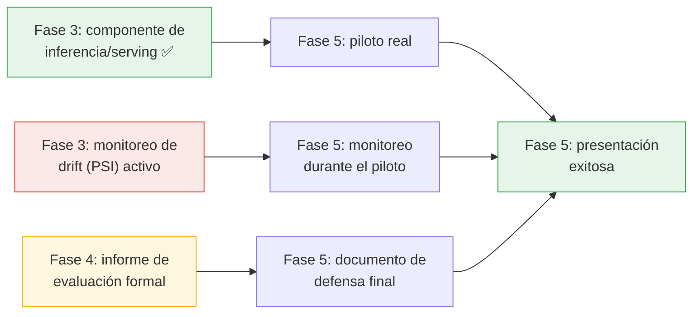

# Diagnóstico de Estado — Fases 3, 4 y 5
## Plataforma de Clasificación de Intenciones — Rocktec MIA 2026

**Versión:** 1.0
**Fecha:** Julio 2026
**Responsable:** Luis Chica (A3) — Arquitectura
**Referencia:** `README.md` §"Fases del Proyecto"

---

## 1. Metodología

`README.md` solo define una meta/hito por fase (p. ej. Fase 3 → "Pipeline funcional", Fase 4 →
"F1 ≥ 0.75", Fase 5 → "Presentación exitosa"), sin un desglose de entregables — igual que ocurría
con Fase 2 antes de este trabajo. Este diagnóstico infiere el alcance esperado de cada fase a partir
de (a) las 5 etapas ya diseñadas en `05_documentacion/DISEÑO_MLOPS_FASE2.md`, (b) lo que el nombre
de cada fase implica típicamente en un proyecto de este tipo, y (c) evidencia real en el repositorio
(scripts, resultados, documentos), marcando cada punto como ✅ hecho / 🟡 parcial / ❌ pendiente.

---

## 2. Fase 3 — Desarrollo e Implementación

**Meta formal (README):** "Pipeline funcional" — vence **31 Ago 2026** (~5 semanas desde hoy).

| Ítem | Estado | Evidencia / brecha |
|------|:---:|---------------------|
| Etapa 1 (Ingesta & ETL) implementada como scripts ejecutables | ✅ | `01_limpieza_datos.py`, `02_consolidar_datos.py`, `03_validar_duplicados.py`, `06_pipeline_completo.py` |
| Etapa 2 (Feature Engineering: TF-IDF + tokenización BERT) implementada | ✅ | `04_feature_engineering.py` |
| Etapa 3 (Entrenamiento con tracking MLflow) implementada | ✅ | `05_entrenar_modelos.py`, `12_beto_finetuning.py`, `mlruns/` |
| Etapa 4 (Evaluación) implementada y reportada | ✅ | Ver Fase 4 más abajo — meta cuantitativa ya alcanzada |
| Etapa 5 (Monitoreo de drift vía PSI) implementada como job real | ❌ | Solo **diseñada** en `DISEÑO_MLOPS_FASE2.md` §3; no existe ningún script que calcule PSI sobre predicciones reales. Ya documentado como riesgo **R7** en `ANALISIS_RIESGOS_FASE2.md`. |
| Pipeline orquestado end-to-end en un solo punto de entrada (ETL → features → entrenamiento → evaluación) | 🟡 | `06_pipeline_completo.py` orquesta **solo** la Etapa 1 (ETL). No hay un comando único que corra desde datos crudos hasta el modelo evaluado — hoy se ejecuta script por script, manualmente. |
| Componente de inferencia / serving (tomar 1 mensaje nuevo y devolver una predicción) | ✅ (batch) | Implementado 25 Jul 2026: `02_scripts/15_entrenar_produccion.py` (reentrena sobre el 100% de los datos etiquetados, guarda artefacto versionado en `06_resultados/modelos/produccion/`) + `02_scripts/16_inferencia.py` (`predecir(textos)` y CLI). Diseño deliberado por lotes, no API en vivo — ver fila siguiente. Marca `revisar_manual` bajo confianza 0.50 (mitigación de R1/R2). Detalle en `DISEÑO_MLOPS_FASE2.md`, Etapa 4.5. |
| Integración con WhatsApp Business (el problema de negocio original, `DISEÑO_MLOPS_FASE2.md` §1) | ❌ | El proyecto trabaja sobre exportaciones históricas en Excel, no sobre mensajes en vivo — por eso la inferencia se diseñó por lotes en vez de como API. No implementada ni diseñada en detalle todavía. |
| Base de datos (PostgreSQL) para log de mensajes/predicciones | ❌ (pospuesto) | `16_inferencia.py` ya escribe un log a `06_resultados/predicciones/log_predicciones.csv` como sustituto interino. Sin integración en vivo con WhatsApp, CSV basta — PostgreSQL se retoma cuando exista ingesta en vivo. Ver `PROPUESTA_REVISADA_FASE2.md` §2, ajuste #8. |
| CI/CD | 🟡 | **CI implementado** (`.github/workflows/ci.yml`): compila los scripts y reentrena+evalúa TF-IDF+LR sobre `holdout_test.csv` en cada push a `main`, con gate de F1-macro ≥ 0.75. **CD sigue pendiente** — ya existe un artefacto de inferencia que desplegar (`06_resultados/modelos/produccion/`), pero aún no hay a dónde desplegarlo (sin integración en vivo con WhatsApp no hay un servicio real que actualizar automáticamente). Ver `PROPUESTA_REVISADA_FASE2.md` §2, ajuste #9. |
| Empaquetado versionado del modelo de producción (TF-IDF+LR) | ✅ | Resuelto por `15_entrenar_produccion.py`: `06_resultados/modelos/produccion/metadata.json` registra versión (`v1.0`), fecha, hiperparámetro ganador y la referencia de F1 honesto — separado del experimento de `05_entrenar_modelos.py`. |

**Conclusión Fase 3:** las 5 etapas del diseño MLOps ya existen como scripts ejecutables, y ahora
también el **componente de inferencia** (batch) que era el bloqueante crítico — ya no bloquea el
arranque de Fase 5. Quedan dos brechas para que sea un "pipeline funcional" completo: (1)
orquestación end-to-end en un solo entrypoint, y (2) el monitoreo de drift activo (Etapa 5), que
ahora sí tiene de dónde leer datos gracias al log de `16_inferencia.py`.

---

## 3. Fase 4 — Evaluación del Modelo

**Meta formal (README):** "F1-macro ≥ 0.75" — vence **14 Sep 2026** (~7 semanas desde hoy).
Estado declarado: "🔜 Por hacer (meta ya validada en holdout, falta cerrar el resto de entregables)".

| Ítem | Estado | Evidencia / brecha |
|------|:---:|---------------------|
| Meta cuantitativa (F1-macro ≥ 0.75 en holdout nunca antes visto) | ✅ | TF-IDF+LR F1=0.7938, BETO fine-tuned F1=0.7967 (`13_evaluacion_holdout.py` → `06_resultados/reporte_holdout_final.txt`) |
| Metodología de evaluación sin fuga de datos | ✅ | Corregida en Sprint 7 (split `train_val.csv` / `holdout_test.csv`, verificación vía `FUENTE_ENTRENAMIENTO.txt`) |
| Matrices de confusión y reportes por clase | ✅ | `confusion_matrix_logistic_regression.png`, `confusion_matrix_svm.png`, `reporte_lr.txt`, `reporte_svm.txt` — **verificar** que correspondan a la corrida final de holdout y no solo al split 80/20 original de `05_entrenar_modelos.py` |
| Explicabilidad (SHAP/LIME) sobre el modelo de producción | ✅ (LR) / 🟡 (BETO) | LR: `10_shap_lime_explicabilidad.py`. BETO: `14_explicabilidad_beto.py` ya corrido pero aún sin commitear (pendiente de la conversación anterior). |
| Análisis de errores cualitativo (qué tipo de mensajes se confunden y por qué, más allá del número) | ❌ | No hay un documento dedicado a esto — solo la observación repetida de que "TEC es la clase más débil", sin un desglose de patrones de error (p. ej. ¿se confunde con INF? ¿con COT? ¿mensajes muy cortos?). |
| Informe formal de evaluación de Fase 4 | 🟡 | `INFORME_AJUSTES_Y_VALIDACION.docx` existe pero es el entregable de **Fase 1C** (heurístico vs. consenso) — no cubre la evaluación holdout final ni la comparación de 3 arquitecturas de Sprint 7. Probablemente se necesite un informe nuevo (o una versión ampliada) que consolide todo esto como cierre de Fase 4. |
| Validación de negocio (que alguien de Rocktec revise/valide los resultados) | ❌ | No hay evidencia en el repo de que Rocktec haya revisado el F1 alcanzado o ejemplos reales de predicciones. |
| Clase TEC con soporte insuficiente para evaluar con confianza (8 filas en el holdout) | 🟡 | Riesgo conocido y documentado (**R1**, **R10** en `ANALISIS_RIESGOS_FASE2.md`), pendiente decidir si bloquea el cierre formal de Fase 4 o se acepta con nota explícita. |

**Conclusión Fase 4:** la meta cuantitativa central ya está **cumplida y es defendible**
(metodología rigurosa, sin fuga, validación cruzada pareada). La brecha real no es técnica sino de
**empaquetado del entregable**: falta un informe formal que consolide la evaluación final (distinto
del de Fase 1C) y un análisis de errores cualitativo, además de decidir el tratamiento de TEC.

---

## 4. Fase 5 — Piloto y Defensa Final

**Meta formal (README):** "Presentación exitosa" — vence **21 Sep 2026** (~8 semanas desde hoy).

| Ítem | Estado | Evidencia / brecha |
|------|:---:|---------------------|
| Piloto real con tráfico de Rocktec | ❌ | No implementado ni iniciado — depende de que Fase 3 tenga un componente de inferencia/serving, que hoy no existe. |
| Monitoreo de drift (PSI) corriendo sobre el piloto | ❌ | Solo diseñado (§3/§5 de `DISEÑO_MLOPS_FASE2.md`), no implementado como job real. Mismo gap que Fase 3 — riesgo **R7**. |
| Documento o guion de presentación de defensa final | ❌ | No encontré ninguna presentación, guion o slides en el repositorio. |
| Documento de tesis final consolidado (versión única para el comité) | ❌ | El contenido narrativo del proyecto vive repartido entre `README.md`, `CHANGELOG.md` y varios `.docx`/`.md` en `05_documentacion/`/`06_resultados/` — no hay un documento único de tesis que los consolide, que normalmente se espera para una defensa formal. |
| Cronograma semanal con responsables (entregable de Fase 2 que ordenaría el camino hasta Fase 5) | ❌ | Sigue pendiente (identificado como el último entregable abierto de Fase 2). |

**Conclusión Fase 5:** es la fase **menos avanzada de las tres** — no puede empezar realmente hasta
que Fase 3 entregue el componente de inferencia y el monitoreo de drift esté activo. Hoy no hay
ningún artefacto de "defensa final" (ni presentación ni documento de tesis consolidado).

---

## 5. Resumen Ejecutivo

| Fase | Meta formal | Estado de la meta | Mayor brecha para cerrar la fase |
|------|-------------|:---:|-----------------------------------|
| **Fase 3** | Pipeline funcional | 🟡 Inferencia batch ya implementada (25 Jul); falta orquestación end-to-end | Un entrypoint único para todo el pipeline (ETL→features→entrenamiento→evaluación); el resto (inferencia) ya no bloquea |
| **Fase 4** | F1-macro ≥ 0.75 | ✅ Meta cuantitativa alcanzada (0.7938–0.7967), metodología ya validada y sin fuga | Informe de evaluación formal + análisis de errores cualitativo — la métrica ya existe, el "entregable" no |
| **Fase 5** | Piloto + presentación exitosa | ❌ No iniciada — bloqueada por Fase 3 | Todo: piloto real, monitoreo de drift activo, documento/presentación de defensa |

---

## 6. Por Qué el Orden Importa (dependencias entre fases)

El componente de inferencia (F3A) ya está resuelto (25 Jul 2026) — el bloqueante crítico restante
para Fase 5 pasó a ser el monitoreo de drift (F3B), que ahora sí tiene de dónde leer datos gracias
al log de `16_inferencia.py`. Fase 4 ya está sustancialmente resuelta en su aspecto cuantitativo, así
que el camino crítico real hasta el 21 Sep se reduce a implementar ese monitoreo de drift y cerrar
los entregables formales (informe de evaluación, cronograma, documento de defensa).

---

*Documento generado: Julio 2026 — Equipo MIA Rocktec*
